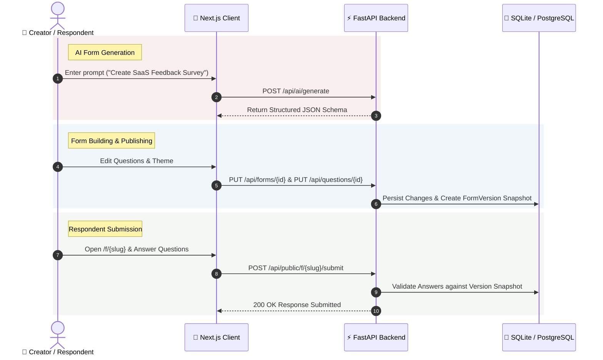

<div align="center">

  # 🌊 RIPPLE 2.0
  ### *Handcrafted Conversational Form Builder & AI Survey Generator*

  <p align="center">
    <a href="https://ripple-form.vercel.app"><strong>🌐 Live Demo (Frontend)</strong></a> •
    <a href="https://ripple-form.onrender.com/docs"><strong>⚡ Live API Docs (Swagger)</strong></a>
  </p>

  <p align="center">
    
    
    
    
    
    
  </p>

  ---

  <p align="center">
    <em>Transform standard boring forms into tactile, conversational experiences that people actually enjoy completing.</em>
  </p>

</div>

---

## ✨ Features at a Glance

| Feature | Description |
| :--- | :--- |
| 🎨 **Organic Crayon Design System** | Tactile paper textures (`#FCFBF7`), Deep Burgundy (`#6E1F2A`) brand accents, and 5 curated themes. |
| 🤖 **AI Form Generator** | Natural language prompts converted into structured JSON schemas via Groq AI & fallback engine. |
| 🛠️ **3-Panel Form Builder** | Drag-and-drop question ordering (`dnd-kit`), active canvas editor, and live right-panel inspector. |
| 💬 **Conversational Respondent View** | Single-question focus (`/f/{slug}`), Framer Motion slide transitions, and keyboard shortcuts (`Enter`, `Shift+Enter`, `Key 1-9`). |
| 🔒 **Immutable Versioning** | Publishing locks a `FormVersion` snapshot. Historical submissions retain exact question definitions. |
| 📊 **Analytics & CSV Exports** | Aggregated views, completion rates, rating distributions, and authenticated RFC4180 CSV file downloads. |

---

## 📸 Interactive System Flow & Architecture



---

## 🛠️ Tech Stack

### Frontend
- **Framework**: Next.js 14 (App Router, TypeScript)
- **Styling**: Vanilla CSS & Tailwind CSS tokens
- **State Management**: Zustand & React Query
- **Animations**: Framer Motion
- **Drag & Drop**: `dnd-kit`
- **Icons**: Lucide React

### Backend
- **Framework**: Python FastAPI
- **Database / ORM**: SQLAlchemy 2.0 (Async Session) & SQLite / PostgreSQL
- **Security & Auth**: JWT Bearer Tokens, OAuth2 & bcrypt password hashing
- **Testing**: `pytest` test suite (4/4 passed)

---

## 🚀 Quick Start & Local Setup

### 1. Clone & Set Up Backend

```bash
cd backend
python -m pip install -r requirements.txt
python seed.py
python -m uvicorn app.main:app --host 127.0.0.1 --port 8000 --reload
```

### 2. Set Up Frontend

```bash
cd frontend
npm install
npm run dev
```

Open [http://localhost:3000](http://localhost:3000) in your browser.

---

## 🔑 Demo Account Credentials

- **Email**: `demo@ripple.com`
- **Password**: `password123`

---

## 🧪 Running Automated Tests

```bash
cd backend
python -m pytest tests -v
```

Tests cover end-to-end user journeys: **Register → Login → Create Form → AI Generation → Publish → Respondent View → Submit → Analytics → CSV Export**.

---

<div align="center">
  <sub>Handcrafted with care for Ripple 2.0</sub>
</div>
