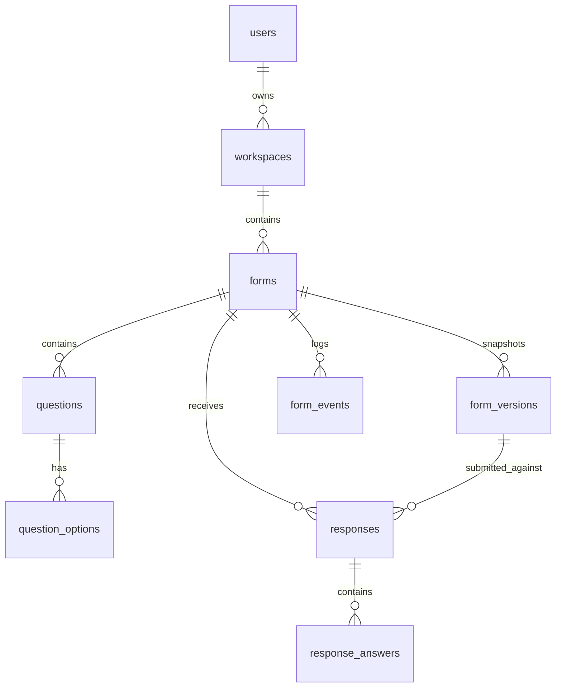

# FormFlow — Production-Grade Full-Stack Form Builder SaaS

> **Tagline**: *Create forms people actually enjoy completing.*

FormFlow is a modern, premium SaaS platform inspired by the conversational respondent experience of Typeform, built with an original visual identity, architecture, components, and code.

---

## 🚀 Key Features

- **3-Panel Form Builder**: Fast drag-and-drop question ordering (`dnd-kit`), active question canvas, and right-panel question inspector.
- **Real-Time Debounced Autosave**: State indicators (`Saving...`, `✓ Saved`, error retry) prevent data loss.
- **Command Palette (`Cmd+K` / `Ctrl+K`)**: Keyboard-driven workflow for adding questions, publishing, switching themes, undo/redo.
- **Undo / Redo History**: Bounded state stack (`Cmd+Z`, `Cmd+Shift+Z`).
- **Immutable Form Versioning**: Publishing creates a `FormVersion` snapshot (`snapshot_json`). Edits to published forms do NOT mutate historical response definitions.
- **Form Health Auditor**: Pre-publish validation checks titles, required settings, and choice values with click-to-focus on broken items.
- **Conversational Respondent Experience (`/f/{slug}`)**: Full-screen single-question view, Framer Motion slide transitions, keyboard navigation (`Enter`, `Shift+Enter`, `1-9`, `Y/N`), and local progress recovery.
- **Server-Side Validation**: Server validates every submission against the published form snapshot schema.
- **Submissions & Analytics Dashboard**: Paginated response tables, individual response inspector, CSV exports, star rating distributions, and Net Promoter Score (NPS) calculations.
- **10 Seeded Templates & AI Form Generator**: Instant form creation from industry templates or structured AI prompts.

---

## 🛠 Tech Stack

### Frontend
- **Framework**: Next.js (TypeScript, App Router)
- **Styling**: Tailwind CSS (Custom FormFlow design tokens)
- **State & Async**: TanStack Query (React Query) & Zustand
- **Animations**: Framer Motion
- **Drag & Drop**: dnd-kit
- **Icons**: Lucide React

### Backend
- **Framework**: Python FastAPI
- **ORM**: SQLAlchemy 2.0 (Async Session)
- **Database**: SQLite (local evaluation) / PostgreSQL-compatible models
- **Migrations**: Alembic
- **Authentication**: JWT Bearer Tokens & bcrypt password hashing
- **Testing**: pytest & httpx async tests

---

## 📊 Database Schema (Mermaid ER Diagram)



---

## ⚡ Quick Start & Local Setup

### 1. Prerequisites
- Python 3.10+
- Node.js 18+

### 2. Backend Setup
```bash
cd backend
python -m pip install -r requirements.txt
python seed.py
uvicorn app.main:app --reload --port 8000
```

### 3. Frontend Setup
```bash
cd frontend
npm install
npm run dev
```

Open [http://localhost:3000](http://localhost:3000) in your browser.

---

## 🔑 Seed Demo Credentials

- **Email**: `demo@formflow.com`
- **Password**: `password123`

Pre-loaded with 5 forms (2 published, 2 draft, 1 archived) and 25+ realistic responses with version snapshots and analytics!

---

## 🧪 Running Automated Tests

```bash
cd backend
python -m pytest tests -v
```

Includes end-to-end integration tests (`test_e2e_flow.py`) covering:
**Create → Publish → Public Form → Submit → View Response → Analytics → CSV Export**.

---

## 🐳 Docker Deployment

```bash
docker-compose up --build
```
- Frontend: `http://localhost:3000`
- Backend API & OpenAPI Docs: `http://localhost:8000/docs`
