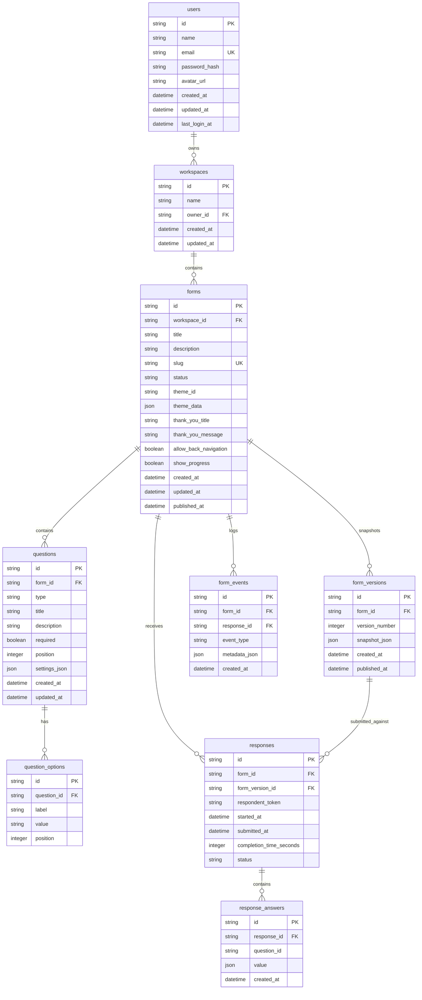

# FormFlow Database Schema & Entity-Relationship Specifications

FormFlow utilizes a normalized relational database schema designed for high performance, strict referential integrity, and immutable versioning.

---

## 1. Entity-Relationship Diagram (Mermaid)

---

## 2. Table Definitions & Key Indexes

### 2.1 `users`
- Primary Key: `id` (UUID)
- Unique Index: `email` (lowercased)

### 2.2 `forms`
- Primary Key: `id` (UUID)
- Foreign Key: `workspace_id` -> `workspaces(id)`
- Unique Index: `slug`

### 2.3 `form_versions`
- Primary Key: `id` (UUID)
- Foreign Key: `form_id` -> `forms(id)`
- `snapshot_json`: Complete JSON payload of published form structure.

### 2.4 `responses`
- Primary Key: `id` (UUID)
- Foreign Keys: `form_id` -> `forms(id)`, `form_version_id` -> `form_versions(id)`
